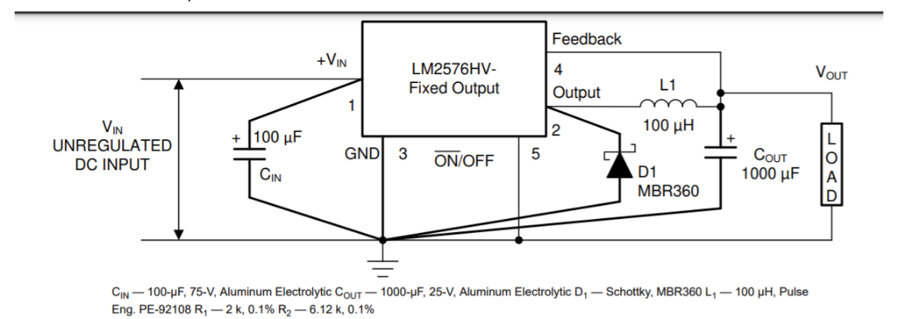

# PCB Design

Welcome to the PCB Design repository. This project consists of several key modules including a Voltage Regulator, an LED Flasher, and a Voltage Distribution Board. All images and related videos are hosted in the repository.

---

## Voltage Regulator

The voltage regulator was designed to ensure that the voltage of the rover would not exceed 5 Volts. This was accomplished by reducing the input voltage (12 Volts) down to 5 Volts or less. The primary component used in this project is:

- **LM2576**  
  LM2576 is a 3-A step-down voltage regulator that accepts an input range of 40 to 60 Volts and can output 3.3, 5, 12, or 15 Volts. For our project, we configured it to output 3.3 Volts. After thorough research, this component was deemed the most appropriate choice. The accompanying circuit diagram illustrates how the required output voltage is achieved.

  
*Figure 1: LM2576 characteristic picture*

### Basic Circuit Components

The circuit design was based on the provided diagram and utilized:
- A 100 µF capacitor
- A 1000 µF capacitor
- A specific diode
- A 100 µH inductor

  
*Figure 2: Voltage regulator circuit diagram*

### Schematic and Board Designs (EasyEDA)

The following images show the schematic, board view, and 3D view of the voltage regulator. **Note:** Although SMD (Surface Mount Devices) were ideal for this project, THT (Through Hole Technology) components were used due to availability.

#### Schematic

  
*Figure 3: Voltage regulator schematic*

#### Board View
To reduce wiring VCC and GND nets were used globally and locally. For testing and debugging, 5 volt and GND probes were also used. 

  
*Figure 4: Voltage regulator board view*

#### 3D View

  
*Figure 5: Voltage regulator 3D view*

---

## LED Flasher

The LED Flasher is designed to produce four different blinking LED patterns. The circuit incorporates the following components:

- **LEDs**
- **Resistors**
- **555 Timer:** This chip generates pulses at varying intervals based on the timing components (resistors and capacitors) connected to it.
- **Dual D FF (Dual D Flip-Flop):** These components store single binary digits ("1" or "0"). Their outputs depend on the input signals and wiring configurations.
- **Capacitors**

### Pinout and Component Details

The pinout for the 555 timer and the configuration of the dual D FF are shown below:

  
*Figure 6: 555 Timer Pinout*

  
*Figure 7: Dual D Flip-Flop*

### Schematic and Board Design (EAGLE CAD)

The schematic and board view for the LED flasher are provided below:

  
*Figure 8: LED Flasher schematic*

  
*Figure 9: LED Flasher board view*

---

## Voltage Distribution Board

The Voltage Distribution Board is designed to route the input voltage to various loads, ensuring that each module receives its required power level. The input voltage is distributed across multiple branches, each tailored to the specifications of the connected circuitry. Detailed schematics and further design documentation for the Voltage Distribution Board will be provided in future updates.

### Schematic and Board Design (EAGLE CAD)
  
*Figure 10: Voltage distribution schematic*

  
*Figure 11: Voltage distribution board view*

---

